# Concept drift datasets
This folder contains 14 stream datasets which simulates different concept drift for experimental purpose. 
These datasets have been generated sintetically with the MOA tool. 
As all of them have 1M instances, they are not going to be ignored in the repository but the scripts to generate them can be found in this document.

- [Stream generators used](#stream-generators-used)
  * [Agrawal generator](#agrawal-generator)
  * [Random Tree (RT) generator](#random-tree--rt--generator)
  * [Radial Basis Function (RBF) Generator](#radial-basis-function--rbf--generator)
  * [Streaming Ensemble (SEA) generator](#streaming-ensemble--sea--generator)
	* [LED generator](#agrawal-generator) 
- [Data streams generated](#data-streams-generated)
  * [Incremental drift](#incremental-drift)
    + [RBFi-slow](#rbfi-slow)
    + [RBFi-fast](#rbfi-fast)
  * [Abrupt drift](#abrupt-drift)
    + [RTGa](#rtga)
    + [RTGa3](#rtga3)
    + [ARGWa-F1F10](#argwa-f1f10)
    + [ARGWa-F2F5F8](#argwa-f2f5f8)
    + [ARGWa-F3F6F3F6](#argwa-f3f6f3f6)
    + [SEAa-F2F4](#seaa-f2f4)
  * [Gradual drift](#gradual-drift)
    + [RTGg](#rtgg)
    + [RTGg3](#rtgg3)
    + [ARGWg-F1F10](#argwg-f1f10)
    + [ARGWg-F2F5F8](#argwg-f2f5f8)
    + [ARGWg-F3F6F3F6](#argwg-f3f6f3f6)
    + [SEAg-F2F4](#seag-f2f4)


## Stream generators used
> information taken from [MOA](https://moa.cms.waikato.ac.nz/documentation/) and [scikit-multiflow](https://scikit-multiflow.github.io/scikit-multiflow/index.html) documentation.

### Agrawal generator 
The generator was introduced by Agrawal et al in [1](#https://ieeexplore.ieee.org/stamp/stamp.jsp?arnumber=250074), and was common source of data for early work on scaling up decision tree learners. The generator produces a stream containing nine features, six numeric and three categorical. There are ten functions defined for generating binary class labels from the features. Presumably these determine whether the loan should be approved.

### Random Tree (RT) generator
This generator is built based on its description in Domingo and Hulten’s ‘Knowledge Discovery and Data Mining’. The generator is based on a random tree that splits features at random and sets labels to its leafs.

The tree structure is composed on Node objects, which can be either inner nodes or leaf nodes. The choice comes as a function fo the parameters passed to its initializer.

Since the concepts are generated and classified according to a tree structure, in theory, it should favour decision tree learners.

### Radial Basis Function (RBF) generator
This generator produces a radial basis function stream.

A number of centroids, having a random central position, a standard deviation, a class label and weight, are generated. A new sample is created by choosing one of the centroids at random, taking into account their weights, and offsetting the attributes at a random direction from the centroid’s center. The offset length is drawn from a Gaussian distribution.

This process will create a normally distributed hypersphere of samples on the surrounds of each centroid.

### Streaming Ensemble (SEA) generator
This generator was first described in Street and Kim’s ‘A streaming ensemble algorithm (SEA) for large-scale classification’.

It generates 3 numerical attributes, that vary from 0 to 10, where only 2 of them are relevant to the classification task. A classification function is chosen, among four possible ones. These functions compare the sum of the two relevant attributes with a threshold value, unique for each of the classification functions. Depending on the comparison the generator will classify an instance as one of the two possible labels.

Concept drift is possible if used in conjunction with the concept drift generator, that at the time of this framework’s first release is not yet implemented. The abrupt drift is generated by changing the classification function, thus changing the threshold.

Two important features are the possibility to balance target_values, which means the class distribution will tend to a uniform one, and the possibility to add noise, which will, according to some probability, change the chosen label for an instance.

### LED generator
This data source originates from the CART book. An implementation in C was donated to the UCI 2 machine learning repository by David Aha. The goal is to predict the digit displayed on a seven-segment LED display, where each attribute has a 10% chance of being inverted. It has an optimal Bayes classification rate of 74%. The particular configuration of the generator used for experiments ( LED ) produces 24 binary attributes, 17 of which are irrelevant.

## Data streams generated

### Incremental drift

#### RBFi-slow
This is a stream generated with the RBF generator which simulates a stream with slow **incremental** drift. It has been parametrized with 20 numerical attributes and 3 classes and drift speed of 0.0001. 

```
WriteStreamToARFFFile 
    -s (generators.RandomRBFGeneratorDrift 
        -s 0.0001 
        -c 3 
        -a 20) 
    -f /media/hd1/plara/datastream-minerva/datasets_drift/RBFi-slow.arff 
    -m 1000000
```

<p align="center">
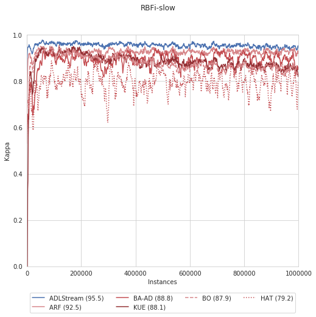
</p>


#### RBFi-fast
This is a stream generated with the RBF generator which simulates a stream with fast **incremental** drift. It has been parametrized with 20 numerical attributes and 3 classes and drift speed of 0.001. 

```
WriteStreamToARFFFile 
    -s (generators.RandomRBFGeneratorDrift 
        -s 0.001 
        -c 3 
        -a 20) 
    -f /media/hd1/plara/datastream-minerva/datasets_drift/RBFi-fast.arff 
    -m 1000000
```
<p align="center">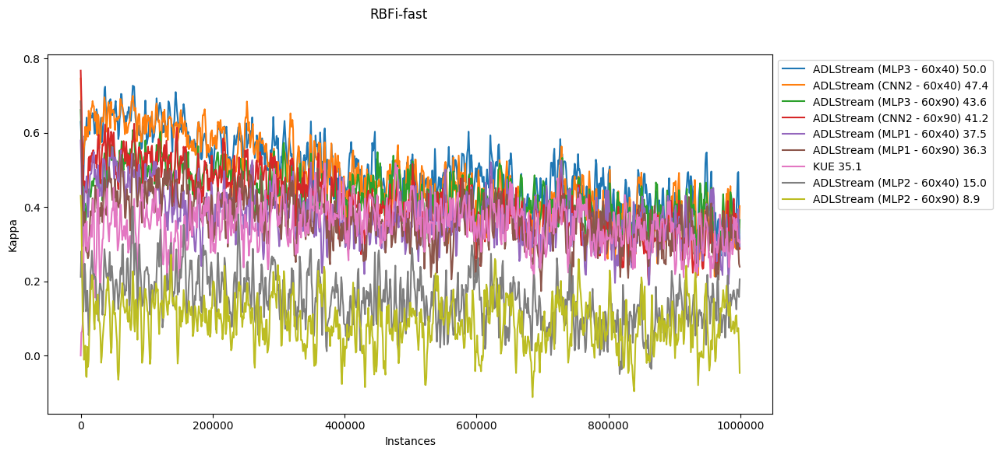
</p>

#### LED-4
This stream implements an **abrupt** drift of 4 atributes from LED dataset.
```
WriteStreamToARFFFile 
        -s (generators.LEDGeneratorDrift 
                -d 4) 
        -f /media/hd1/plara/datastream-minerva/datasets_drift/LED-4.arff 
        -m 1000000
```

<p align="center">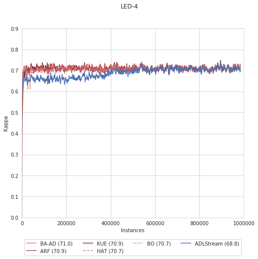</p>

### Abrupt drift

#### RTGa
This stream simulates an **abrupt** drift using the RT generator.
It has been parametrized with 20 numerical attributes and 3 classes. The concept drift is set at instance 500k.

```
WriteStreamToARFFFile 
    -s (ConceptDriftStream 
        -s (generators.RandomTreeGenerator 
            -r 1 
            -i 1 
            -c 3 
            -o 0 
            -u 20
            -d 5 
            -l 3) 
        -d (generators.RandomTreeGenerator 
                -r 2 
                -i 2 
                -c 3 
                -o 0 
                -u 20 
                -d 7 
                -l 5)
        -p 500000 
        -w 1) 
    -f /media/hd1/plara/datastream-minerva/datasets_drift/RTGa.arff 
    -m 1000000
```

<p align="center">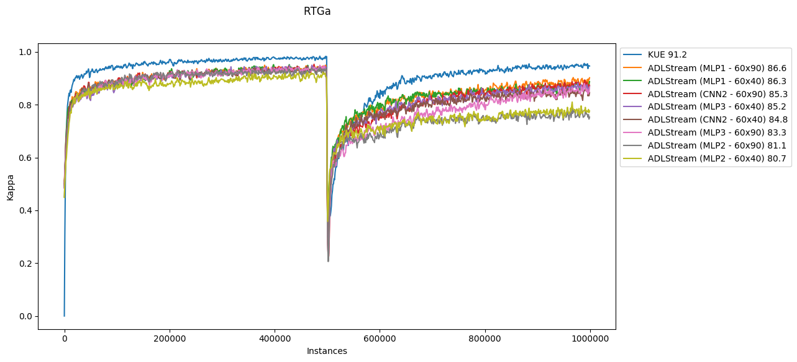</p>

#### RTGa3

This stream simulates three **abrupt** drifts using the Random Tree generator. Similarly to the previous one, the resulting streams have 20 numerical attributes and 3 classes. The drifts happen in the instance 250k, 500k and 750k.

```
WriteStreamToARFFFile 
    -s (ConceptDriftStream 
        -s (generators.RandomTreeGenerator 
            -r 1 
            -i 1 
            -c 3 
            -o 0 
            -u 20
            -d 5 
            -l 3) 
        -d (ConceptDriftStream 
            -s (generators.RandomTreeGenerator 
                -r 2 
                -i 2 
                -c 3 
                -o 0 
                -u 20
                -d 7 
                -l 5) 
            -d (ConceptDriftStream 
                -s (generators.RandomTreeGenerator 
                    -r 3
                    -i 3
                    -c 3 
                    -o 0 
                    -u 20
                    -d 7
                    -l 3) 
                -d (generators.RandomTreeGenerator 
                    -r 4 
                    -i 4 
                    -c 3 
                    -o 0 
                    -u 20
                    -d 5 
                    -l 5) 
                -p 250000 
                -w 1) 
            -p 250000 
            -w 1) 
        -p 250000 
        -w 1) 
    -f /media/hd1/plara/datastream-minerva/datasets_drift/RTGa3.arff 
    -m 1000000
```

<p align="center">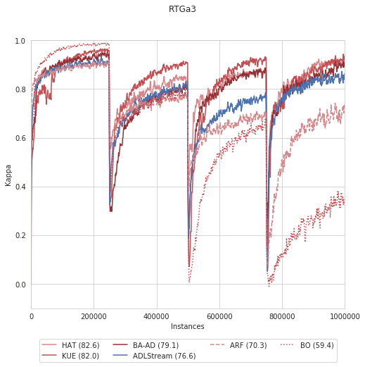</p>

#### ARGWa-F1F4
This stream simulates an **abrupt** drift from Argwal's function 1 to Argwal's function 10 in the instance number 500k. 

```
WriteStreamToARFFFile 
	-s (ConceptDriftStream 
		-s generators.AgrawalGenerator 
		-d (generators.AgrawalGenerator 
			-f 4) 
		-p 500000 
		-w 1) 
	-f /media/hd1/plara/datastream-minerva/datasets_drift/ARGWa-F1F10.arff 
	-m 1000000
```
<p align="center">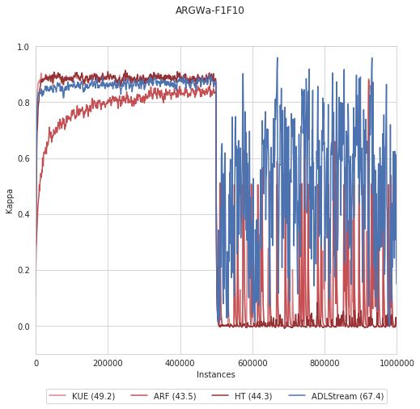</p>

#### ARGWa-F2F5F8
This stream simulates two **abrupt** drifts from Argwal's function 2 to Argwal's function 5 and then to Argwal's function 8 in the instances 330k and 660k. 

```
WriteStreamToARFFFile 
    -s (ConceptDriftStream 
        -s (generators.AgrawalGenerator 
		-f 2)
        -d (ConceptDriftStream 
            -s (generators.AgrawalGenerator 
		-f 5)
            -d (generators.AgrawalGenerator 
			-f 8)  
            -p 330000 
            -w 1) 
        -p 330000 
        -w 1) 
    -f /media/hd1/plara/datastream-minerva/datasets_drift/ARGWa-F2F5F8.arff 
    -m 1000000
```
<p align="center">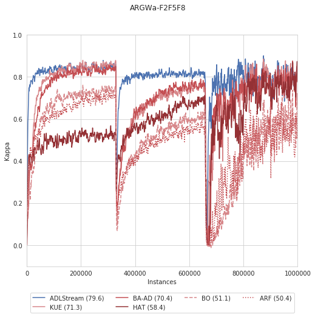</p>

#### ARGWa-F3F6F3F6
This stream simulates a **recurrent** **abrupt** drift between Argwal's functions 3 and 6. The concept is drift three times (instances 250k, 500k and 750k).

```
WriteStreamToARFFFile 
    -s (ConceptDriftStream 
        -s (generators.AgrawalGenerator 
							-f 3)
        -d (ConceptDriftStream 
            -s (generators.AgrawalGenerator 
									-f 6)
            -d (ConceptDriftStream
									-s (generators.AgrawalGenerator 
											-f 3)
									-d (generators.AgrawalGenerator 
											-f 6)  
									-p 250000 
									-w 1) 
            -p 250000 
            -w 1) 
        -p 250000 
        -w 1) 
    -f /media/hd1/plara/datastream-minerva/datasets_drift/ARGWa-F3F6F3F6.arff 
    -m 1000000
```

<p align="center">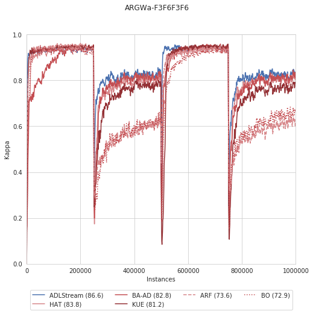</p>

#### SEAa-F2F4
This stream implements an **abrupt** drift from SEA's function 2 to SEA's function 4 in the instance 500k
```
WriteStreamToARFFFile 
	-s (ConceptDriftStream 
		-s (generators.SEAGenerator 
			-f 2) 
		-d (generators.SEAGenerator 
			-f 4) 
		-p 500000 
		-w 1) 
	-f /media/hd1/plara/datastream-minerva/datasets_drift/SEAa-F2F4.arff 
	-m 1000000
```
<p align="center">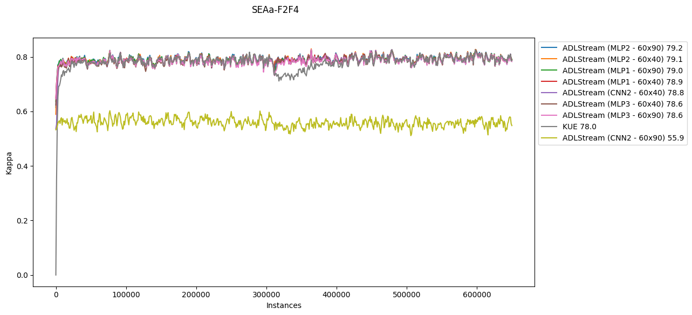</p>

### Gradual drift

#### RTGg

This stream simulates an **gradual** drift using the RT generator.
It has been parametrized with 20 numerical attributes and 3 classes. The concept drift is set at instance 500k.

```
WriteStreamToARFFFile 
    -s (ConceptDriftStream 
        -s (generators.RandomTreeGenerator 
            -r 1 
            -i 1 
            -c 3 
            -o 0 
            -u 20
            -d 5 
            -l 3) 
        -d (generators.RandomTreeGenerator 
                -r 2 
                -i 2 
                -c 3 
                -o 0 
                -u 20 
                -d 7 
                -l 5)
        -p 500000 
        -w 100000) 
    -f /media/hd1/plara/datastream-minerva/datasets_drift/RTGg.arff 
    -m 1000000
```
<p align="center">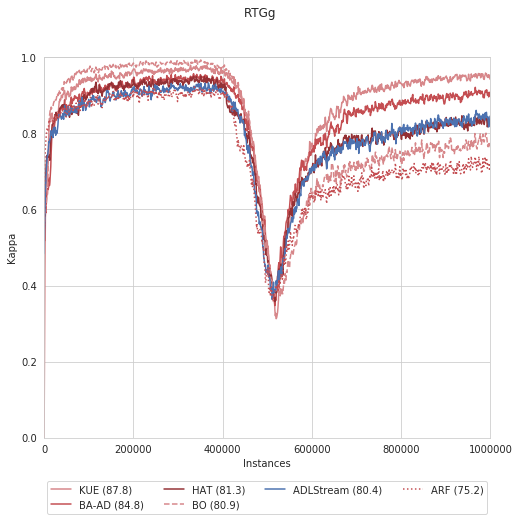</p>

#### RTGg3
This stream simulates three **gradual** drifts using the Random Tree generator. Similarly to the previous one, the resulting streams have 20 numerical attributes and 3 classes. The drifts happen in the instance 250k, 500k and 750k. All of them with a drift width of 100k.

```
WriteStreamToARFFFile 
    -s (ConceptDriftStream 
        -s (generators.RandomTreeGenerator 
            -r 1 
            -i 1 
            -c 3 
            -o 0 
            -u 20
            -d 5 
            -l 3) 
        -d (ConceptDriftStream 
            -s (generators.RandomTreeGenerator 
                -r 2 
                -i 2 
                -c 3 
                -o 0 
                -u 20 
                -d 7 
                -l 5) 
            -d (ConceptDriftStream 
                -s (generators.RandomTreeGenerator 
                    -r 3
                    -i 3
                    -c 3 
                    -o 0 
                    -u 20
                    -d 7
                    -l 3) 
                -d (generators.RandomTreeGenerator 
                    -r 4 
                    -i 4 
                    -c 3 
                    -o 0 
                    -u 20
                    -d 5 
                    -l 5) 
                -p 250000 
                -w 100000) 
            -p 250000 
            -w 100000) 
        -p 250000 
        -w 100000) 
    -f /media/hd1/plara/datastream-minerva/datasets_drift/RTGg3.arff 
    -m 1000000
```
<p align="center">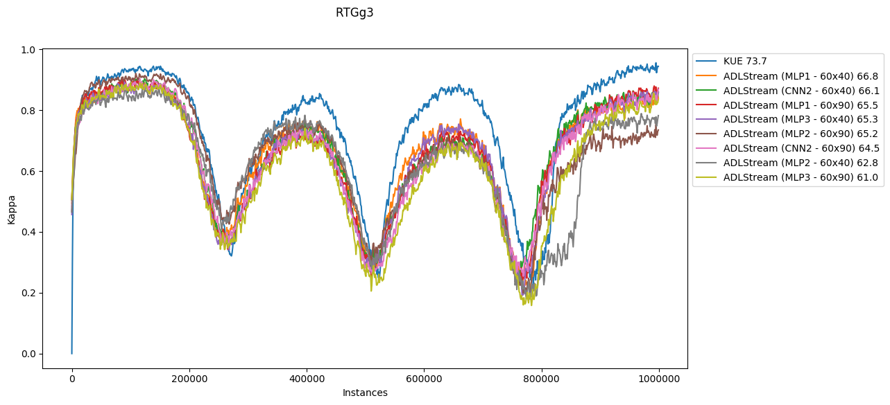</p>


#### ARGWg-F1F4
This stream simulates an **abrupt** drift from Argwal's function 1 to Argwal's function 10 in the instance number 500k with a drift width of 100k instances.

```
WriteStreamToARFFFile 
	-s (ConceptDriftStream 
		-s generators.AgrawalGenerator 
		-d (generators.AgrawalGenerator 
			-f 4) 
		-p 500000  
		-w 100000) 
	-f /media/hd1/plara/datastream-minerva/datasets_drift/ARGWg-F1F10.arff 
	-m 1000000
```


#### ARGWg-F2F5F8
This stream simulates two **gradual** drifts from Argwal's function 2 to Argwal's function 5 and then to Argwal's function 8 in the instances 330k and 660k. Both of them with a drift width of 100k instances.

```
WriteStreamToARFFFile 
    -s (ConceptDriftStream 
        -s (generators.AgrawalGenerator 
		-f 2)
        -d (ConceptDriftStream 
            -s (generators.AgrawalGenerator 
		-f 5)
            -d (generators.AgrawalGenerator 
			-f 8) 
            -p 330000 
            -w 100000) 
        -p 330000 
        -w 100000) 
    -f /media/hd1/plara/datastream-minerva/datasets_drift/ARGWg-F2F5F8.arff 
    -m 1000000
```
<p align="center">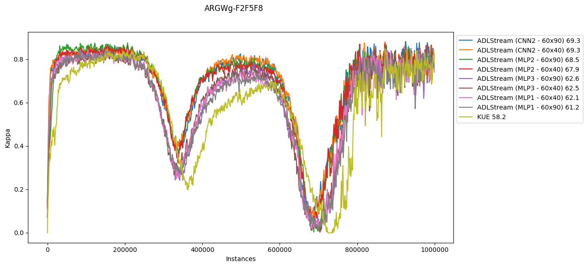</p>

#### ARGWg-F3F6F3F6
This stream simulates a **recurrent** **gradual** drift between Argwal's functions 3 and 6. The concept is drift three times (instances 250k, 500k and 750k) with a drift width of 100k instances each concept drift.

```
WriteStreamToARFFFile 
    -s (ConceptDriftStream 
        -s (generators.AgrawalGenerator
						-f 3)
        -d (ConceptDriftStream 
           -s (generators.AgrawalGenerator 
								-f 6)
           -d (ConceptDriftStream
								-s (generators.AgrawalGenerator 
										-f 3)
								-d (generators.AgrawalGenerator 
										-f 6)  
								-p 250000 
								-w 100000) 
            -p 250000 
            -w 100000) 
        -p 250000 
        -w 100000) 
    -f /media/hd1/plara/datastream-minerva/datasets_drift/ARGWg-F3F6F3F6.arff 
    -m 1000000
```
<p align="center"></p>

#### SEAg-F2F4
This stream implement a **gradual** drift from SEA's function 2 to SEA's function 4 in the instance 500k with a drift width of 100k instances.
```
WriteStreamToARFFFile 
	-s (ConceptDriftStream 
		-s (generators.SEAGenerator 
			-f 2) 
		-d (generators.SEAGenerator 
			-f 4) 
		-p 500000 
		-w 100000) 
	-f /media/hd1/plara/datastream-minerva/datasets_drift/SEAg-F2F4.arff 
	-m 1000000
```
<p align="center">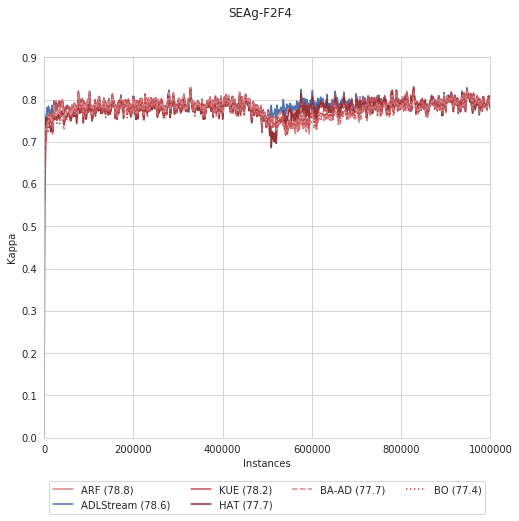</p>


