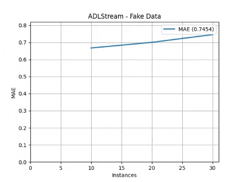

# Getting Started 

These instructions explain how to use ADLStream framework with a simple example.

In this example we will use a LSTM model for time series forecasting in streaming.

### 1. Create the stream

Fist of all we will need to create the stream.
Stream objects can be created using the classes from `ADLStream.data.stream`. We can choose different options depending on the source of our stream (from a csv file, a Kafka cluster, etc). 

In this example, we will use the `FakeStream`, which implements a sine wave.

```python
import ADLStream

stream = ADLStream.data.stream.FakeStream(
    num_features=6, stream_length=1000, stream_period=100
)
```

More precisely, this stream will return a maximun of 1000 instances. The stream sends one message every 100 milliseconds (0.1 seconds).

### 2. Create the stream generator.

Once we have our source stream, we need to create our stream generator. 
A `StreamGenerator` is an object that will preprocess the `stream` and convert the messages into input (`x`) and target (`y`) data of the deep learning model.
There are different options to choose under `ADLStream.data` and, if needed, we can create our custom `StreamGenerator` by inheriting `BaseStreamGenerator`.

As our problem is time series forecasting, we will use the `MovingWindowStreamGenerator`, which performs the moving-window preprocessing method.

```python
stream_generator = ADLStream.data.MovingWindowStreamGenerator(
    stream=stream, past_history=12, forecasting_horizon=3, shift=1
)
```

For the example we have set the past history to 12 and the model will predict the next 3 elements.

### 3. Configure the evaluation process.

In order to evaluate the performance of the model, we need to create a validator object. 
There exist different alternative for data-stream validation, some of the most common one can be found under `ADLStream.evaluation`. 
Furthermore, custom evaluators can be easily implemented by inheriting `BaseEvaluator`.

In this case, we are going to create a `PrequentialEvaluator` which implements the idea that more recent examples are more important using a decaying factor.

```python
evaluator = ADLStream.evaluation.PrequentialEvaluator(
    chunk_size=10,
    metric="MAE",
    fadding_factor=0.98,
    results_file="ADLStream.csv",
    dataset_name="Fake Data",
    show_plot=True,
    plot_file="test.jpg",
)
```

As can be seen, we are using the mean absolute error (MAE) metrics. Other options can be found in `ADLStream.evaluation.metrics`.
The evaluator will save the progress of the error metric in `results_file` and will also plot the progress and saved the image in `plot_file`.

### 4. Configure model and create ADLStream

Finally we will create our `ADLStream` object specifying the model to use.

The required model arguments are the architecture, the loss and the optimizer. In addition, we can provides a dict with the model parameters to customize its architecture. 
All the available model architecture and its parameters can be found in `ADLStream.models`.

For the example we are using a deep learning model with 3 stacked LSTM layers of 16, 32 and 64 units followed by a fully connected block of two layers with 16 and 8 neurons.

```python
model_architecture = "lstm"
model_loss = "mae"
model_optimizer = "adam"
model_parameters = {
    "recurrent_units": [16, 32, 64],
    "recurrent_dropout": 0,
    "return_sequences": False,
    "dense_layers": [16, 8],
    "dense_dropout": 0,
}

adls = ADLStream.ADLStream(
    stream_generator=stream_generator,
    evaluator=evaluator,
    batch_size=60,
    num_batches_fed=20,
    model_architecture=model_architecture,
    model_loss=model_loss,
    model_optimizer=model_optimizer,
    model_parameters=model_parameters,
    log_file="ADLStream.log",
)
```

### 5. Run ADLStream & Results

Once we came the ADLStream object created, we can initiate it by calling its `run` function.

```python
adls.run()
```

The processes will start and the progress will be plot obtaining a result similar to this one




Additionally, a csv file with the results is saved.

```
    timestamp,              instances,      metric
2020-09-25 13:11:47.870072,     10,     0.6671632251028352
2020-09-25 13:11:47.870133,     20,     0.7000225956890218
2020-09-25 13:11:47.870142,     30,     0.7454178792614996
2020-09-25 13:11:48.036082,     40,     0.7929847150800008
    ...                         ...             ...
2020-09-25 13:13:11.258858,     880,    0.004199111102948505
2020-09-25 13:13:12.259646,     890,    0.004511320478529503
2020-09-25 13:13:13.290345,     900,    0.0036451097272695654
2020-09-25 13:13:14.262223,     910,    0.004776173660790596
2020-09-25 13:13:15.266534,     920,    0.006658613535302106
```

If you need to know more details of what the framework is doing, you can check the log file.

```
2020-09-25 13:11:35,739 WARNING  TRAINING-PROCESS - GPU device using: device:GPU:0
2020-09-25 13:11:35,742 WARNING  PREDICTING-PROCESS - GPU device using: device:GPU:1
2020-09-25 13:11:43,774 INFO     TRAINING-PROCESS - Training with the last 60 instances
2020-09-25 13:11:46,349 INFO     Starting predictions
2020-09-25 13:11:46,351 INFO     TRAINING-PROCESS - Training with the last 60 instances
2020-09-25 13:11:46,387 INFO     PREDICTING-PROCESS: 32 instances predicted.
2020-09-25 13:11:47,866 INFO     TRAINING-PROCESS - Training with the last 92 instances
2020-09-25 13:11:47,901 INFO     PREDICTING-PROCESS: 15 instances predicted.
2020-09-25 13:11:47,980 INFO     PREDICTING-PROCESS: 1 instances predicted.
2020-09-25 13:11:48,072 INFO     PREDICTING-PROCESS: 1 instances predicted.
2020-09-25 13:11:48,175 INFO     PREDICTING-PROCESS: 1 instances predicted.
2020-09-25 13:11:48,273 INFO     PREDICTING-PROCESS: 1 instances predicted.
2020-09-25 13:11:48,371 INFO     PREDICTING-PROCESS: 1 instances predicted.
2020-09-25 13:11:48,472 INFO     PREDICTING-PROCESS: 1 instances predicted.
2020-09-25 13:11:48,569 INFO     PREDICTING-PROCESS: 1 instances predicted.
2020-09-25 13:11:48,621 INFO     TRAINING-PROCESS - Training with the last 114 instances
2020-09-25 13:11:48,686 INFO     PREDICTING-PROCESS: 1 instances predicted.
2020-09-25 13:11:48,695 INFO     TRAINING-PROCESS - Training with the last 115 instances
2020-09-25 13:11:48,783 INFO     PREDICTING-PROCESS: 1 instances predicted.
2020-09-25 13:11:48,844 INFO     TRAINING-PROCESS - Training with the last 116 instances
2020-09-25 13:11:48,877 INFO     PREDICTING-PROCESS: 1 instances predicted.

...

2020-09-25 13:13:15,291 INFO     TRAINING-PROCESS - Training with the last 979 instances
2020-09-25 13:13:15,300 INFO     PREDICTING-PROCESS: 1 instances predicted.
2020-09-25 13:13:15,397 INFO     PREDICTING-PROCESS: 1 instances predicted.
2020-09-25 13:13:15,498 INFO     PREDICTING-PROCESS: 1 instances predicted.
2020-09-25 13:13:15,618 INFO     TRAINING-PROCESS - Training with the last 982 instances
2020-09-25 13:13:15,624 INFO     PREDICTING-PROCESS: 1 instances predicted.
2020-09-25 13:13:15,690 INFO     PREDICTING-PROCESS: 1 instances predicted.
2020-09-25 13:13:15,791 INFO     PREDICTING-PROCESS: 1 instances predicted.
2020-09-25 13:13:15,912 INFO     PREDICTING-PROCESS: 1 instances predicted.
2020-09-25 13:13:15,915 INFO     TRAINING-PROCESS - Training with the last 985 instances
2020-09-25 13:13:15,963 INFO     GENERATOR-PROCESS - Stream has finished
2020-09-25 13:13:15,964 INFO     PREDICTING-PROCESS - Finished stream
2020-09-25 13:13:16,179 INFO     TRAINING-PROCESS - Finished stream
```

### Code

The complete example can be found below

```python
import ADLStream

stream = ADLStream.data.stream.FakeStream(
    num_features=6, stream_length=1000, stream_period=100
)

stream_generator = ADLStream.data.MovingWindowStreamGenerator(
    stream=stream, past_history=12, forecasting_horizon=3, shift=1
)

evaluator = ADLStream.evaluation.PrequentialEvaluator(
    chunk_size=10,
    metric="MAE",
    fadding_factor=0.98,
    results_file="ADLStream.csv",
    dataset_name="Fake Data",
    show_plot=True,
    plot_file="test.jpg",
)

model_architecture = "lstm"
model_loss = "mae"
model_optimizer = "adam"
model_parameters = {
    "recurrent_units": [16, 32, 64],
    "recurrent_dropout": 0,
    "return_sequences": False,
    "dense_layers": [16, 8],
    "dense_dropout": 0,
}

adls = ADLStream.ADLStream(
    stream_generator=stream_generator,
    evaluator=evaluator,
    batch_size=60,
    num_batches_fed=20,
    model_architecture=model_architecture,
    model_loss=model_loss,
    model_optimizer=model_optimizer,
    model_parameters=model_parameters,
    log_file="ADLStream.log",
)

adls.run()
```